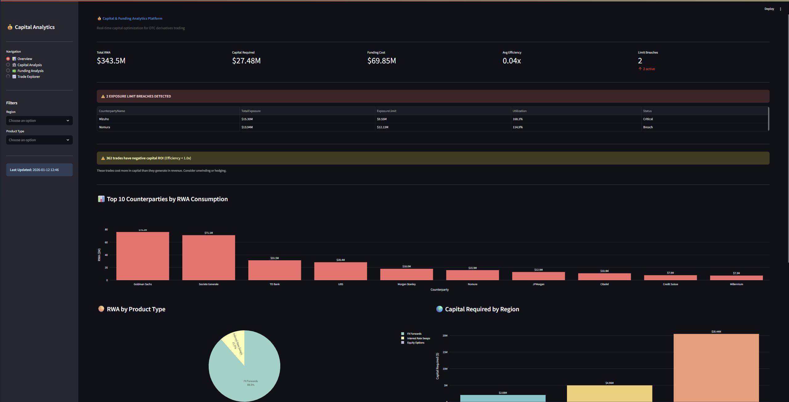
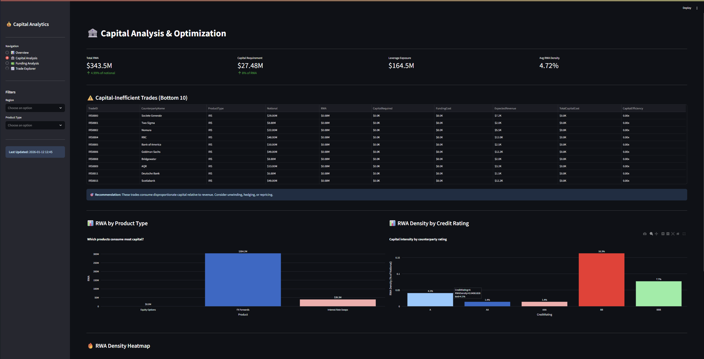
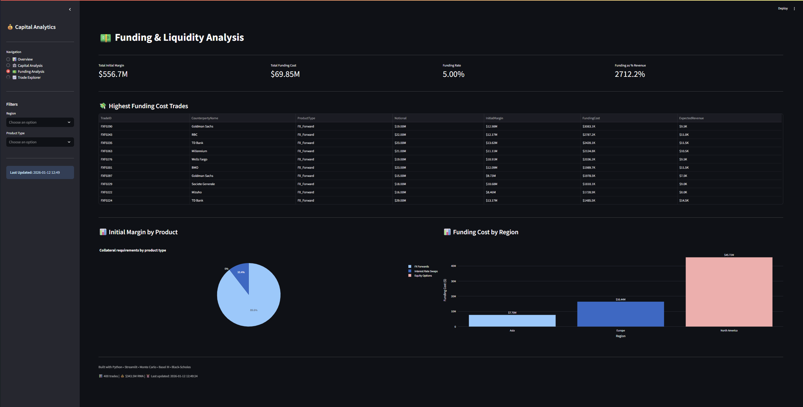
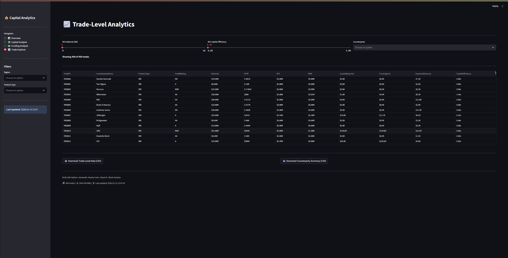

# Risk2Cap – Capital Efficiency Analytics for OTC Derivatives

Risk2Cap is a **data analytics project** that explores how risk exposure in OTC derivatives can be translated into **capital usage and funding impact**, and how these constraints affect trade-level efficiency.

The project is built as an **exploratory decision-support dashboard**, focusing on intuition and relative comparisons rather than regulatory precision.

---

## What is the idea?

In many trading and risk problems, the key question is not just *“Is this trade profitable?”* but:

> **“Is this trade worth the capital and funding it consumes?”**

Risk2Cap studies this question by:
- Estimating risk exposure
- Translating risk into approximate capital usage
- Comparing expected revenue against capital and funding costs

The result is a simple way to **rank and explore trades based on capital efficiency**.

---

## What the project does

- Simulates a portfolio of OTC derivatives:
  - Interest Rate Swaps  
  - FX Forwards  
  - Equity Options  

- Estimates **Potential Future Exposure (PFE)** using Monte Carlo simulation

- Applies **simplified, SA-CCR–style logic** to approximate capital usage

- Models **initial margin and funding costs** based on exposure and maturity

- Computes a **Capital Efficiency score** to compare trades on a balance-sheet basis

- Presents results through an **interactive Streamlit dashboard**

---

## Dashboard Overview

### Portfolio Overview
High-level view of risk, capital usage, leverage exposure, and efficiency metrics across the portfolio.



---

### Capital Analysis
Identifies capital-intensive and capital-inefficient trades, with breakdowns by product and counterparty quality.



---

### Funding & Liquidity Analysis
Explores initial margin requirements, funding costs, and regional concentration of funding usage.



---

### Trade-Level Explorer
Allows drill-down into individual trades, including exposure, capital usage, funding cost, and efficiency metrics.



---

## Tech Stack

- **Python** (Pandas, NumPy, SciPy)
- **Monte Carlo simulation** for exposure estimation
- **Streamlit** for interactive dashboards
- **Plotly** for visualizations


---

## How to run locally

```bash
pip install -r requirements.txt
python generate_data.py
streamlit run dashboard.py
```
---

## Disclaimer
This project uses simulated data and simplified assumptions for learning and exploratory analysis.

It is not intended for production use, trading, or regulatory reporting.
